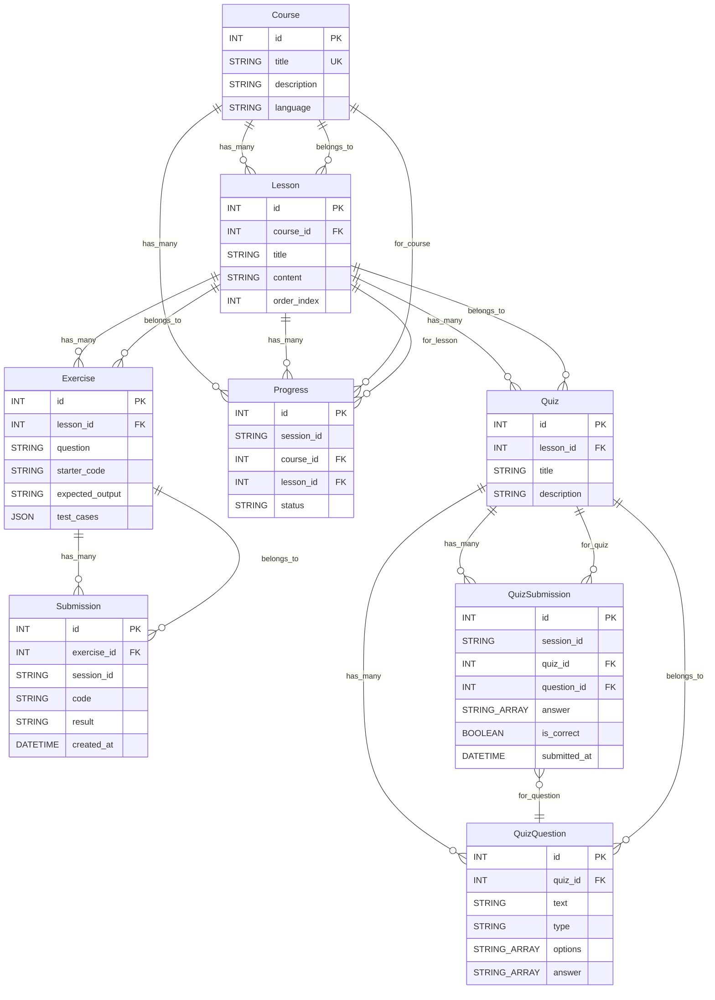

# Atlas Code

## 概要

ブラウザ上でプログラミング言語の学習ができるプラットフォームです。
学習コースやクイズの進捗を管理しながら、ブラウザ内でコードを実行できる環境を提供します。

## 主な機能

- コース・レッスン・クイズを横断した学習進捗の管理
- 演習問題の提出と履歴の確認
- ブラウザ上のコードエディタと実行環境

## 使用技術

| category | tech                                     |
| -------- | ---------------------------------------- |
| frontend | Next.js / TypeScript / Tailwind CSS      |
| backend  | Next.js API Routes / Prisma / PostgreSQL |
| auth     | Clerk                                    |
| infra    | Vercel / Neon (PostgreSQL)               |
| tools    | ESLint / Prettier                        |

## ディレクトリ構成

<!-- directory-structure:start -->

```text
AtlasCode/
|-- atlascode/
|   |-- .env
|   |-- eslint.config.mjs
|   |-- next-env.d.ts
|   |-- next.config.ts
|   |-- package-lock.json
|   |-- package.json
|   |-- postcss.config.mjs
|   |-- prisma/
|   |   |-- schema.prisma
|   |   |-- seed.ts
|   |   `-- migrations/
|   |       |-- 20251014043503_init/
|   |       |-- 20251014052703_implement_full_schema/
|   |       `-- 20251101045927_/
|   |-- public/
|   |   |-- file.svg
|   |   |-- globe.svg
|   |   |-- next.svg
|   |   |-- sandbox.html
|   |   |-- vercel.svg
|   |   `-- window.svg
|   |-- src/
|   |   |-- app/
|   |   |   |-- api/
|   |   |   |   |-- courses/
|   |   |   |   |   `-- route.ts
|   |   |   |   |-- exercises/
|   |   |   |   |   `-- [exerciseId]/route.ts
|   |   |   |   |-- lessons/
|   |   |   |   |   `-- [lessonId]/route.ts
|   |   |   |   |-- progress/
|   |   |   |   |   `-- [sessionId]/route.ts
|   |   |   |   |-- quizzes/
|   |   |   |   |   |-- submit/route.ts
|   |   |   |   |   `-- [quizId]/route.ts
|   |   |   |   |-- submissions/route.ts
|   |   |   |   `-- history/route.ts
|   |   |   |-- exercises/
|   |   |   |   `-- [exerciseId]/page.tsx
|   |   |   |-- history/page.tsx
|   |   |   |-- lessons/
|   |   |   |   `-- [lessonId]/page.tsx
|   |   |   `-- quizzes/
|   |   |       `-- [quizId]/page.tsx
|   |   |-- components/
|   |   |   |-- layout/
|   |   |   |   |-- Footer.tsx
|   |   |   |   |-- Header.tsx
|   |   |   |   `-- Sidebar.tsx
|   |   |   `-- ui/
|   |   |       |-- CodeEditor.tsx
|   |   |       `-- CourseCard.tsx
|   |   |-- generated/
|   |   |   |-- prisma/...
|   |   |   `-- runtime/...
|   |   `-- lib/
|   |       `-- prisma.ts
|   |-- tsconfig.json
|   `-- tsconfig.seed.json
|-- docs/
|   `-- spec.md
`-- READEME.md
```

<!-- directory-structure:end -->

## テーブルスキーマ


